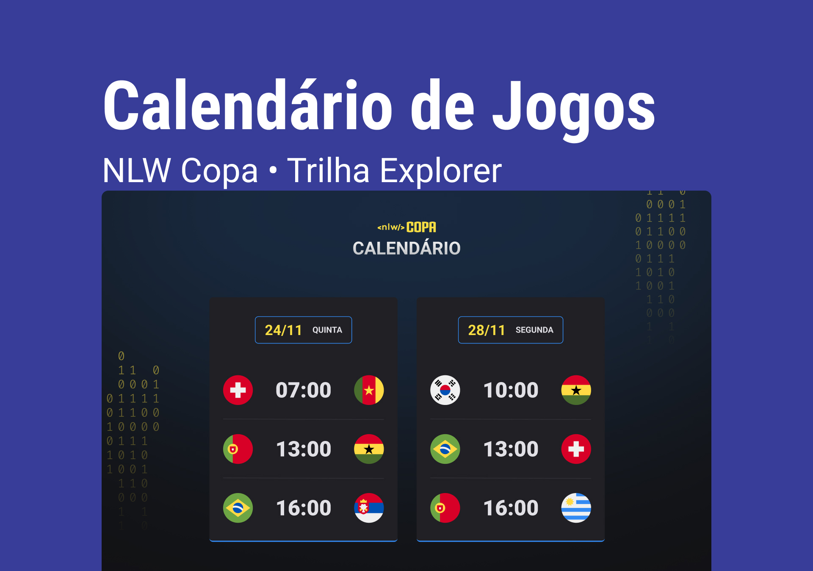

<h1 align="center"> ⚽ NLW 10# Copa ⚽</h1>

Projeto feito para o nlw 10# da rocketseat usando tecnlogias WEB

  <a href="#-tecnologias">Tecnologias</a>&nbsp;&nbsp;&nbsp;|&nbsp;&nbsp;&nbsp;
  <a href="#-projeto">Projeto</a>&nbsp;&nbsp;&nbsp;|&nbsp;&nbsp;&nbsp;
  <a href="#-layout">Layout</a>&nbsp;&nbsp;&nbsp;|&nbsp;&nbsp;&nbsp;
  <a href="#memo-licença">Licença</a>

  

  

## 🚀 Tecnologias

- HTML e CSS
- JavaScript
- Git e Github
- Figma

## 💻 Projeto

Calendário da copa do mundo de 2022 que mostra datas e horários dos jogos.

O projeto pode ser visualizado através [desse link](https://will-g-comnisky.github.io/NLW-Copa-Explorer/)

## 🔖 Layout

É possível acessar o layout através [desse link](<https://www.figma.com/file/3vJag61Mwp00SpzFtf8pgc/Calend%C3%A1rio-de-Jogos-(Community)>)

## :memo: Licença

Esse projeto está sob a licença MIT.
